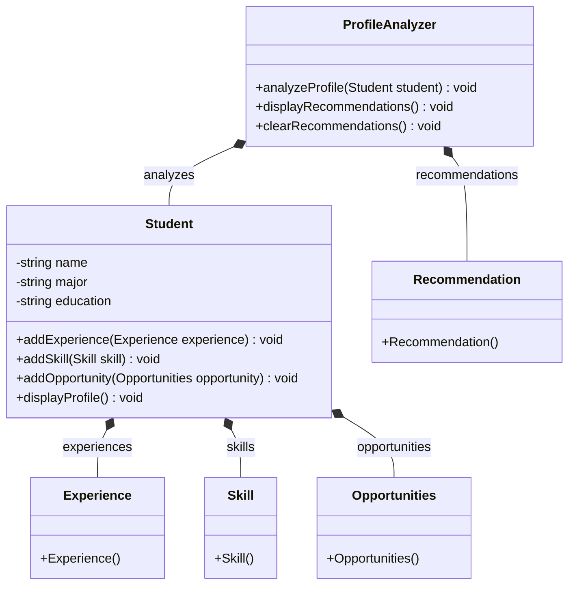

# Path-to-PhD
CIS 25 Major Project 2026 Fall

```mermaid
classDiagram
    

    class Student {
        -string name
        -string major
        -string education
        +addExperience(Experience experience) void
        +addSkill(Skill skill) void
        +addOpportunity(Opportunities opportunity) void
        +displayProfile() void
    }
    class Experience {
        +Experience()
    }
    class Skill {
        +Skill()
    }
    class Opportunities {
        +Opportunities()
    }
    class ProfileAnalyzer {
        +analyzeProfile(Student student) void
        +displayRecommendations() void
        +clearRecommendations() void
    }
    class Recommendation {
        +Recommendation()
    }

    Student *-- Experience : experiences
    Student *-- Skill : skills
    Student *-- Opportunities : opportunities
    ProfileAnalyzer *-- Student : analyzes
    ProfileAnalyzer *-- Recommendation : recommendations
```
